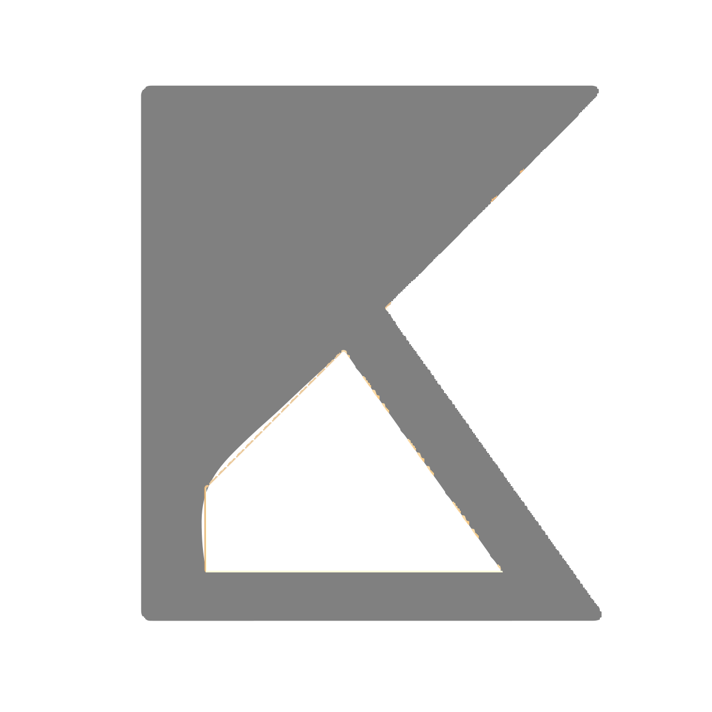
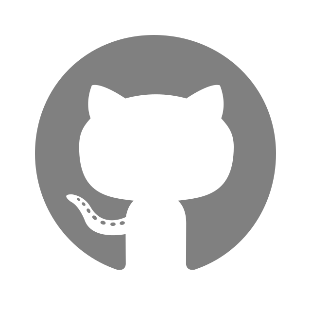

# Hi there👋

I am **Kelly** living in Edmonton AB, Canada.  
I am a self-taught Frontend Web Developer focused on crafting seamless digital experiences that balance functionality, efficiency and aesthetics.

## About Me

I'm passionate about building accessible and user-friendly web applications.  
I enjoy transforming complex ideas into intuitive interfaces and continuously improving my skills through hands-on projects.

## Skills

### Programming Languages

### Libraries & Frameworks

### Tools & Platforms

## Featured Projects

- **Reading Tracker** – A React-based app to manage reading progress with local storage and progress visualization.
- **AI Chat Bot** – Built with React and OpenAI API to interact with an AI model and manage multiple chat sessions.
- **News App** – Built with React and Google News API to search, read, and bookmark global articles.  
🔗 More projects on my [Portfolio Website](https://kellybytes.netlify.app)

## Current Focus

Exploring advanced React patterns and improving UI performance optimization.

---

## Where to Find Me

<a href="mailto:kellybytes.ca@gmail.com">
   Email
</a>
 
<a href="https://kellybytes.netlify.app">
   Portfolio Website
</a>
 
<a href="https://linkedin.com/in/erikoiwashita">
   LinkedIn
</a>
 
<a href="https://github.com/KellyBytes?tab=repositories">
   GitHub Repos
</a>
